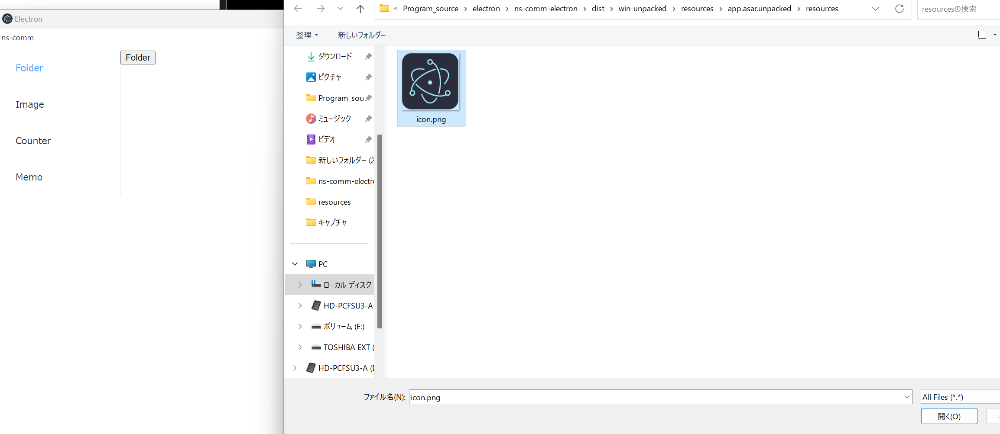
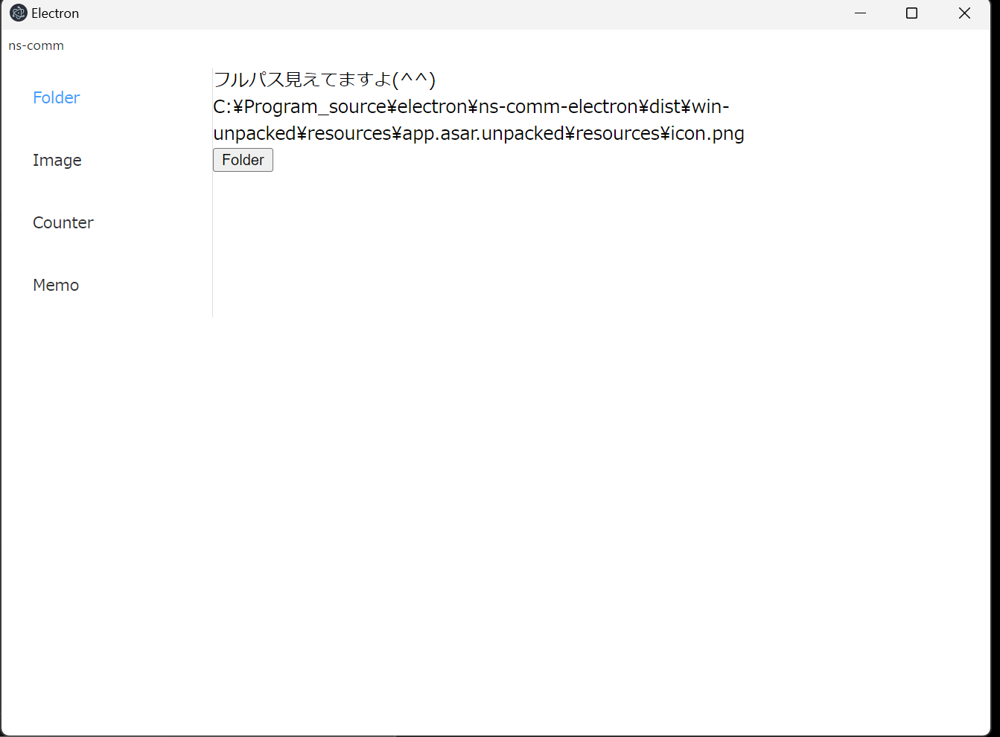
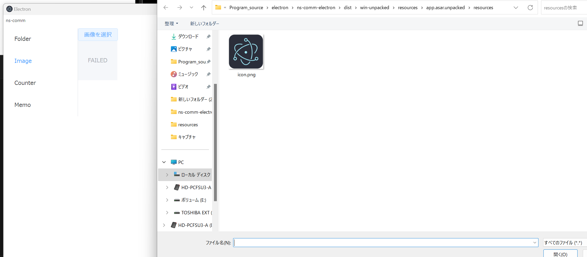
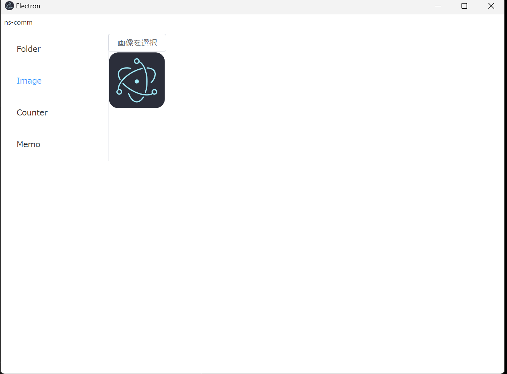
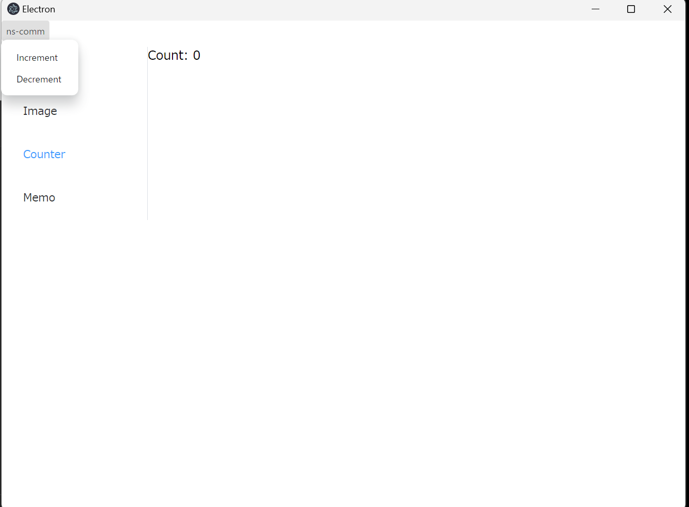
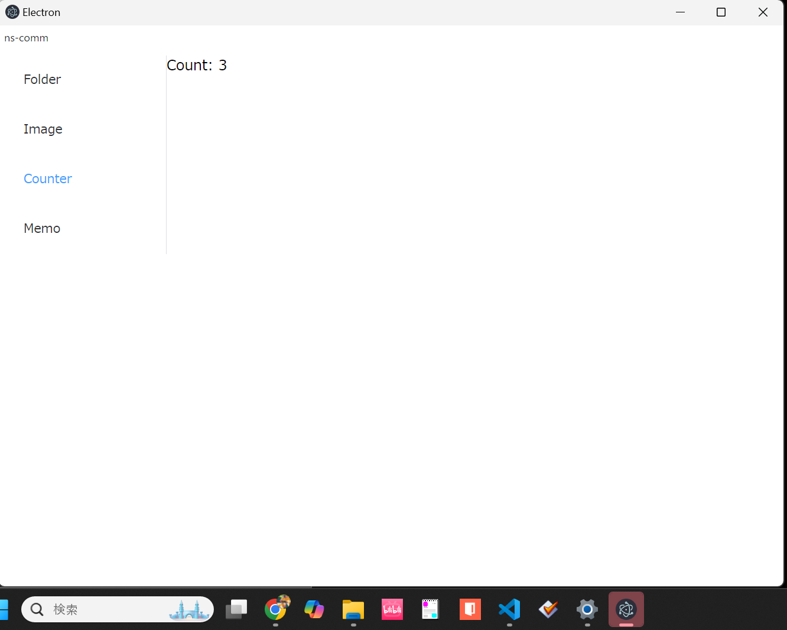
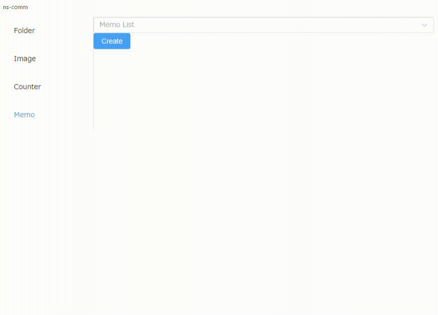

# ns-comm

An Electron application with Vue

## Recommended IDE Setup

- [VSCode](https://code.visualstudio.com/) + [ESLint](https://marketplace.visualstudio.com/items?itemName=dbaeumer.vscode-eslint) + [Prettier](https://marketplace.visualstudio.com/items?itemName=esbenp.prettier-vscode) + [Volar](https://marketplace.visualstudio.com/items?itemName=Vue.volar)

## Project Setup

### Install

```bash
$ npm install
```

### Development

```bash
$ npm run dev
```

### Build

```bash
# For windows
$ npm run build:win

# For macOS
$ npm run build:mac

# For Linux
$ npm run build:linux
```

### 機能

#### Folder

- ファイル選択ダイアログを開く、ファイルを選択するとフルパスが取得できてしまう。
- ※ElectronはChlomiumベースのブラウザなので本来ブラウザからはフルパスは取得できないはず。
  
  

#### Image

- 選んだファイルを表示する。特にElectronは関係ない。ブラウザの機能のみ。
  
  

#### Counter

- アプリケーションネイティブなメニューを追加している。
- カウントが3を超えるとデスクトップアイコンが光る。
  
  

#### Memo

- メモ帳の機能、編集と保存ができる。
  
